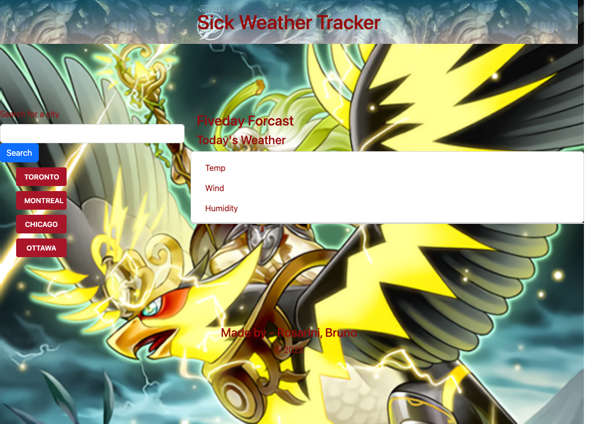

# Sick Weather Dashboard

## Deployment URL

url: 

## Mock-Up



## About

```
- Created a Sick Weather Dashboard for conveniently displaying the Forecast.

- When I search for a city I am presented with current and future conditions for that city and that city is added to the search history.

- When I view current weather conditions for that city I am presented with the city name, the date, an icon representation of weather conditions, the temperature, the humidity, and the wind speed

- When I view future weather Forecasts for that city I am presented with a 5-day forecast that displays the date, an icon representation of weather conditions, the temperature, the wind speed, and the humidity

- When I click on a city in the search history it displays on my webpage and in my search bar allowing me to search that city again to display the weather.
```

## Contributors

```
- Bruno Rosarini
- Austin Grech
- Krishna - Assistant Instructor
```